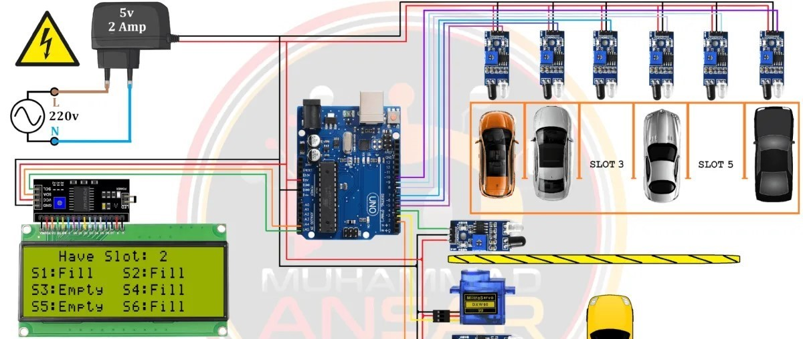

# Automated Reservation and Guidance Car Parking System

This project presents a smart parking solution designed to reduce the time and effort required to find and reserve parking spaces in busy urban environments. The system enables users to check real-time parking availability, reserve slots, and receive guided navigation to their designated parking spot.

It integrates automation, sensor-based monitoring, and user-friendly interfaces to optimize parking space utilization and minimize traffic congestion caused by searching for parking. The system also enhances security and efficiency through controlled access and digital management of parking records.

## Key Features:

->Real-time parking slot availability tracking.

->Online reservation of parking spaces.

->Automated entry and exit management.

->Guided navigation to allocated parking slots.

->Efficient space utilization and reduced congestion.

This project aims to contribute to smart city infrastructure by providing a scalable, efficient, and user-centric parking management solution.

## Technologies Used
-> IoT Sensors

->Arduino / Raspberry Pi

->Embedded Systems

## System Architecture

[ Sensors ] → [ Microcontroller ] → [ Server/Database ] → [ User Interface ]

## How It Works

Sensors detect parking slot occupancy and send data to the microcontroller(Arduino). Server updates availabilty in real-time. Users can view availability, reserve a slot, and receive directions to the assigned parking space.

## Images

## Documentation

Full project report is available in this repository.

## Future Improvements
-> AI-based parking prediction

-> Mobile application 
